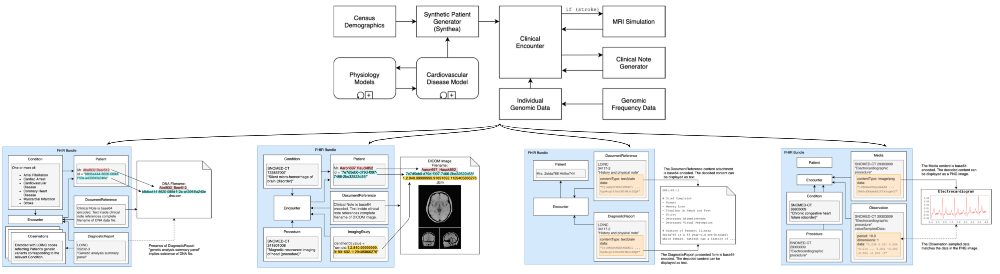
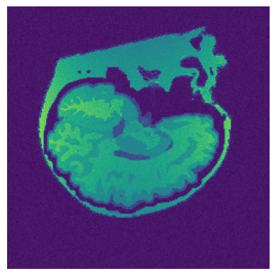
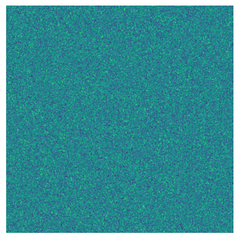

#  MRI
This is the repository for the Magnetic Resonance Imaging (MRI) modality of the pipeline. Together with other modality, we build a multi-modal AI model to diagnose Cardiovascular Disease (CVD). 

## Requirements
`python==3.9.13`  
`torch==1.12.1+cu102`  
`pydicom==2.3.0`  
`numpy==1.23.2`  
`pandas==1.4.4`  
`ipywidgets==8.0.2`  
`skimage==0.19.3`  
`matplotlib==3.5.3`  
`wandb==0.13.4`  
`pytorch_lightning==1.7.7`  

## Data Processing Overview
We use the data from [the Coherent dataset](https://www.researchgate.net/publication/359859530_The_Coherent_Data_Set_Combining_Patient_Data_and_Imaging_in_a_Comprehensive_Synthetic_Health_Record). Below is the dataset organization (pictures from the Coherent dataset paper)

### MRI Brain Scans (Input) Processing
We have in total 298 MRI scans recorded in the DICOM format (`*.dcm`), where DICOM stands for Digital Imaging and Communications in Medicine. Each scan has the shape `(256, 256, 256)`, which means that there are 256 slices (indicated by the last index), each one is a 2D image with `(height, width) = (256, 256)` as illustrated in Figure 1. 

<figure>

<figcaption><b>Figure 1: A slice from the MRI brain scan</b></figcaption>
</figure>

There are also slices that only contain noises, like in Figure 2 below. The noisy slice indices often range from 0-49 and 205-255. Therefore, on the  

<figure>

<figcaption><b>Figure 2: A noisy slice</b></figcaption>
</figure>

### Cardiovascular Disease (Output) Processing
